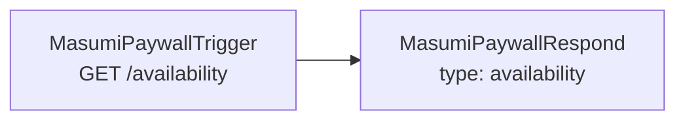
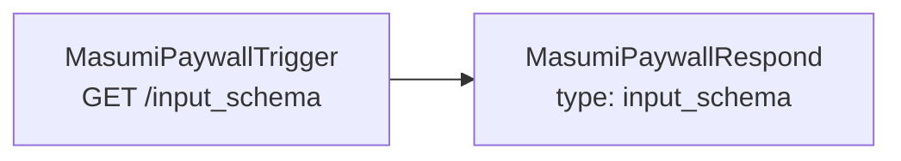
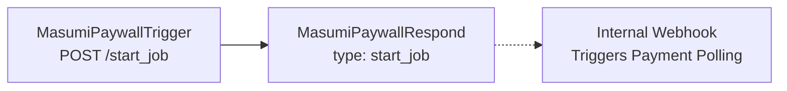
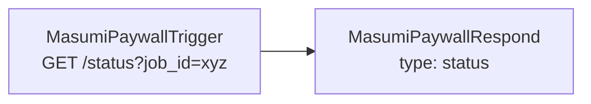
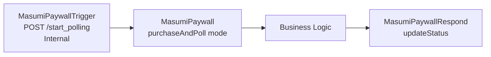
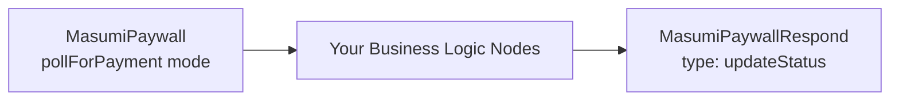

<Info>
This page is automatically synced from the [masumi-network/n8n-nodes-masumi-payment](https://github.com/masumi-network/n8n-nodes-masumi-payment) repository README.
</Info>

The official Masumi n8n community node provides Cardano blockchain paywall functionality for monetizing n8n workflows on Masumi Network.

## Installation

<Tabs>
  <Tab title="Community Nodes (Recommended)">
    <Note>
    Requires self-hosting n8n instance according to official [n8n docs](https://docs.n8n.io/integrations/community-nodes/installation/).
    </Note>

    <Steps>
      <Step title="Open Community Nodes Settings">
        Go to **Settings → Community Nodes** in your n8n instance
      </Step>
      <Step title="Install the Node">
        Click "Install a community node" and search for: `n8n-nodes-masumi-payment`
      </Step>
      <Step title="Confirm Installation">
        Confirm checkbox and click "Install"
      </Step>
    </Steps>
  </Tab>
  <Tab title="Manual Installation">
    <CodeGroup>
    ```bash Terminal
    # In your n8n installation directory
    npm install n8n-nodes-masumi-payment

    # Restart n8n
    ```
    </CodeGroup>
  </Tab>
</Tabs>

## Prerequisites

<Steps>
  <Step title="Deploy Masumi Payment Service">
    You need a running [Masumi payment service](https://docs.masumi.network/installation) instance. Get one up and running in less than 5 minutes by deploying on Railway:

    <a href="https://railway.com/deploy/masumi-payment-service-official?referralCode=pa1ar" target="_blank">
      
    </a>
  </Step>
  <Step title="Top Up Your Wallets">
    You need ADA on your selling wallet for registering an agent, and ADA on your buying wallet to test the full flow. Get test-Ada on:
    - [Masumi ADA faucet](https://dispenser.masumi.network/)
    - [Cardano faucet](https://docs.cardano.org/cardano-testnets/tools/faucet)
  </Step>
  <Step title="Register an Agent">
    Register an agent on Masumi registry using your main n8n workflow URL. [Read more](https://docs.masumi.network/core-concepts/registry). 
    
    By registering your agent you provide:
    - Price of the execution
    - Description
    - Example outputs
  </Step>
  <Step title="Prepare Your Credentials">
    You will need to provide:
    - **Masumi Payment service admin key**
    - **Agent identifier**
    - **vkey** - selling wallet verification key
    
    You can get all these keys from the dashboard on your running Masumi Payment service.
  </Step>
</Steps>

## Configuration

<Steps>
  <Step title="Add Credential">
    In n8n, go to **Credentials → Add Credential**
  </Step>
  <Step title="Search for Masumi">
    Search for "Masumi Paywall API" in the dropdown
  </Step>
  <Step title="Configure Fields">
    | Field | Description |
    |-------|-------------|
    | Payment Service URL | Base URL of your Masumi service |
    | API Key | Your Masumi service API key |
    | Agent Identifier | Your registered agent ID |
    | Seller Verification Key | Cardano wallet verification key |
    | Network | `Preprod` (testnet) or `Mainnet` |
  </Step>
</Steps>

## 3-Node System Architecture

This package provides three specialized nodes for building complete payment-gated workflows.

### Node Types

<CardGroup cols={3}>
  <Card title="Masumi Paywall Trigger" icon="webhook">
    Webhook receiver for external requests
  </Card>
  <Card title="Masumi Paywall Respond" icon="reply">
    Responds to webhooks, creates/updates jobs
  </Card>
  <Card title="Masumi Paywall" icon="credit-card">
    Handles payment polling and workflow execution
  </Card>
</CardGroup>

Each node type provides a user-friendly mostly dropdown-driven operation mode selection or output templates. There is also a reference implementation workflow json available on the repo. Consider using it as starter point.

### Job Storage System

Jobs are stored in **n8n static data** (`this.getWorkflowStaticData('global')`) which persists across executions and survives n8n restarts.

<Accordion title="Job Interface">
```typescript
interface Job {
  job_id: string;                    // Unique 14-character hex identifier
  identifier_from_purchaser: string; // Hex-encoded user identifier  
  input_data: Record<string, any>;   // Parsed input parameters
  status: 'pending' | 'awaiting_payment' | 'awaiting_input' | 'running' | 'completed' | 'failed';
  payment?: {                        // Payment details (when created)
    blockchainIdentifier: string;
    inputHash: string;
    payByTime: string;              // String timestamp
    submitResultTime: string;       // String timestamp
    unlockTime: string;             // String timestamp
    externalDisputeUnlockTime: string; // String timestamp
  };
  result?: any;                      // Business logic output
  error?: string;                    // Error message if failed
  created_at: string;               // ISO timestamp
  updated_at: string;               // ISO timestamp
}
```
</Accordion>

## Required Workflow Architecture

<Warning>
You need to create **5 separate endpoints** with mini-workflows for complete [MIP-003](https://github.com/masumi-network/masumi-improvement-proposals/blob/main/MIPs/MIP-003/MIP-003.md) compliance.
</Warning>

The endpoints should provide MIP-003 compliant responses, hence you must connect triggers to the respond nodes. The triggers and response nodes are separated to give you flexibility.

<Info>
You don't need to specify most of the endpoint and respond pairs - you set them up by just selecting the operation mode for each node from a dropdown. The 3-nodes-architecture is basically Lego™ and if you read the descriptions you are going to connect everything correctly by just following common sense and MIP-003.
</Info>

**Split Workflow Architecture**: Starting from v0.5.0, jobs are immediately accessible after creation via a split workflow design that separates job creation from payment polling for better responsiveness.


### 1. `/availability` Endpoint

**Purpose**: Health check to confirm agent is online (you can manually select `unavailable` from a dropdown)



<CodeGroup>
```json Response
{
  "status": "success", 
  "availability": "available"
}
```
</CodeGroup>

### 2. `/input_schema` Endpoint

**Purpose**: Return input schema for the agent - this one you need to specify manually according to your business logic and agentic workflow functionality



<CodeGroup>
```json Response
{
  "status": "success",
  "input_schema": {
    "prompt": {
      "type": "string", 
      "description": "Text to process"
    }
  }
}
```
</CodeGroup>

### 3. `/start_job` Endpoint

**Purpose**: Create payment request and job, return payment details immediately; automatically triggers internal payment polling in background



<CodeGroup>
```json Input
{
  "identifier_from_purchaser": "user123",
  "input_data": [
    {"key": "prompt", "value": "analyze this text"}
  ]
}
```

```json Response
{
  "status": "success",
  "job_id": "a1b2c3d4e5f678",
  "blockchainIdentifier": "very_long_blockchain_id...",
  "paybytime": 1756129851,
  "submitResultTime": 1756130751,
  "unlockTime": 1756152351,
  "externalDisputeUnlockTime": 1756173951,
  "agentIdentifier": "agent_id...",
  "sellerVKey": "seller_verification_key",
  "identifierFromPurchaser": "757365723132333",
  "amounts": [{"amount": "4200000", "unit": ""}],
  "input_hash": "sha256_hash_of_input_data",
  "_internal_webhook_triggered": "fire-and-forget"
}
```
</CodeGroup>

### 4. `/status` Endpoint

**Purpose**: Return current job status and results (in case the job was fulfilled)



<Tabs>
  <Tab title="Awaiting Payment">
    Status is immediately accessible after starting the job:

    ```json
    {
      "job_id": "a1b2c3d4e5f678",
      "status": "awaiting_payment",
      "paybytime": 1756143592,
      "message": "Waiting for payment confirmation on blockchain"
    }
    ```
  </Tab>
  <Tab title="Running">
    Status is set after payment is confirmed:

    ```json
    {
      "job_id": "a1b2c3d4e5f678",
      "status": "running"
    }
    ```
  </Tab>
  <Tab title="Completed">
    Status is set after the business logic has been fulfilled:

    ```json
    {
      "job_id": "a1b2c3d4e5f678",
      "status": "completed",
      "paybytime": 1756143592,
      "result": {
        "text": "Business logic output here..."
      },
      "message": "Job completed successfully"
    }
    ```
  </Tab>
</Tabs>

### 5. `/start_polling` Endpoint (Internal)

**Purpose**: Internal webhook triggered automatically after job creation to handle payment polling separately



<CodeGroup>
```json Input (Automatically sent)
{
  "job_id": "a1b2c3d4e5f678"
}
```
</CodeGroup>

This endpoint enables the split workflow architecture where:

<Steps>
  <Step title="Immediate Job Creation">
    Job creation completes immediately (jobs become accessible)
  </Step>
  <Step title="Background Polling">
    Payment polling runs as a separate background process
  </Step>
  <Step title="Non-Blocking Flow">
    No blocking operations in the job creation flow
  </Step>
</Steps>

### Business Logic

Add your actual business logic by wrapping it with Masumi Paywall on the input and Masumi Paywall Respond on the output:



<Note>
In the reference template, the Basic LLM Chain is playing a role of a "business logic". Consider replacing this block with your full business logic or a shortcut to a separate n8n workflow.
</Note>

## Workflow Execution Flow

The complete flow for the Split Workflow Architecture (v0.5.0+):

<Steps>
  <Step title="Job Created">
    `/start_job` endpoint creates payment request and job, returns immediately with fire-and-forget webhook triggering
  </Step>
  <Step title="Job Accessible">
    Job status is immediately available via `/status` endpoint (no longer blocked)
  </Step>
  <Step title="Internal Polling">
    MasumiPaywallRespond automatically triggers `/start_polling` internal webhook
  </Step>
  <Step title="Payment Polling">
    Separate workflow polls Masumi Payment service for payment confirmation
  </Step>
  <Step title="Status Update">
    Job status changes `awaiting_payment` → `running` when payment detected
  </Step>
  <Step title="Payment Confirmed">
    Once `FundsLocked` is detected, business logic workflow starts
  </Step>
  <Step title="Business Logic Execution">
    Your actual processing (LLM, API calls, data transformation) happens
  </Step>
  <Step title="Result Storage">
    MasumiPaywallRespond saves result and updates status to `completed`
  </Step>
  <Step title="Getting Results">
    Consumer can get results by checking status with `job_id`
  </Step>
</Steps>

<Info>
**Key Improvement**: Jobs are no longer "not found" immediately after creation - they're accessible with `awaiting_payment` status right away.
</Info>

## Integration with External Systems

<Tabs>
  <Tab title="Sokosumi Marketplace">
    <Steps>
      <Step title="User Initiates">
        User clicks "hire" in Sokosumi after filling out the form (your `input_data`)
      </Step>
      <Step title="Job Creation">
        Sokosumi calls your `/start_job` → Creates payment request → Job immediately accessible
      </Step>
      <Step title="Background Polling">
        Internal webhook automatically starts payment polling in background
      </Step>
      <Step title="Payment Handling">
        Sokosumi handles blockchain payment using returned payment data
      </Step>
      <Step title="Execution">
        Background polling detects `FundsLocked` → Starts business logic workflow
      </Step>
      <Step title="Results">
        Sokosumi polls `/status` → Gets results when completed
      </Step>
    </Steps>
  </Tab>
  <Tab title="Direct API">
    <Steps>
      <Step title="Start Job">
        External system calls `/start_job` → Gets payment details → Job immediately accessible
      </Step>
      <Step title="Auto Polling">
        Background payment polling automatically starts
      </Step>
      <Step title="Manual Payment">
        External system or user manually sends funds to blockchain
      </Step>
      <Step title="Processing">
        Background polling detects payment → Processes job → Returns results via `/status`
      </Step>
    </Steps>
  </Tab>
</Tabs>

## Error Behavior

<Warning>
MasumiPaywall node throws `NodeOperationError` when payment fails or times out, causing the workflow to show as failed (red) in n8n and preventing execution of subsequent nodes until payment is confirmed. This behavior occurs unless "Continue on Fail" is enabled in node settings.
</Warning>

## Payment States

<ResponseField name="FundsLocked" type="string">
  Payment confirmed, workflow continues
</ResponseField>

<ResponseField name="null" type="null">
  Payment pending, most likely you are still polling via MasumiPaywall node
</ResponseField>

<ResponseField name="Error States" type="string">
  The following states will cause workflow failure:
  - `FundsOrDatumInvalid`
  - `RefundRequested`
  - `Disputed`
  - `RefundWithdrawn`
  - `DisputedWithdrawn`
</ResponseField>

## Development

<CodeGroup>
```bash Build and Lint
npm install && npm run build && npm run lint
```

```bash Test Payment Status
# Test standalone functions
node dist/nodes/MasumiPaywall/check-payment-status.js --blockchain-identifier <id>
```
</CodeGroup>

<Tip>
You probably want to clean the npm nodes cache on n8n and restart your n8n instance if you are updating this package. Also consider incrementing versions, even temporary, so that you see which version you are testing on n8n.
</Tip>

## License

MIT License
